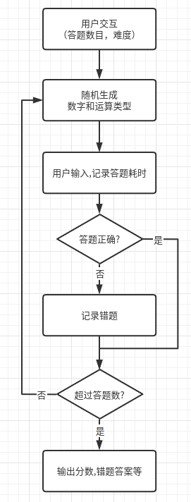
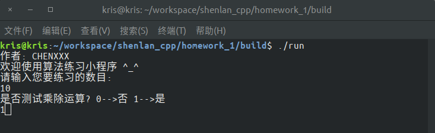
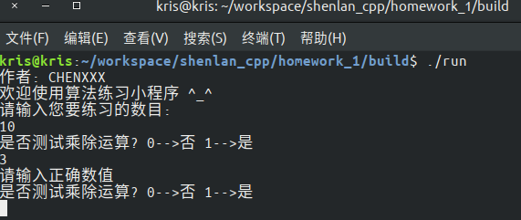
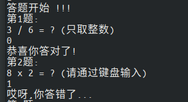
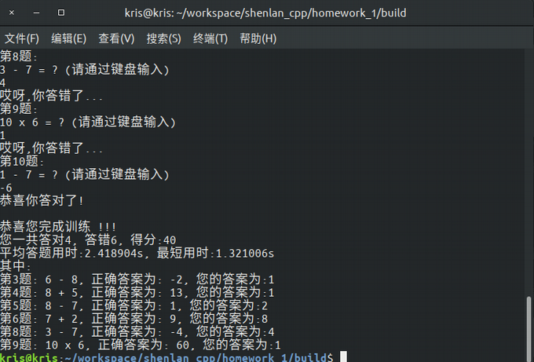

# shenlan_cpp_homework_1
深蓝学院《c++基础与深度解析》第二期第一次作业

**作业仅供参考**

### 完成情况

​		本次作业我完成了**项目1**，**扩展1**和**扩展2**的所有内容，包括：给出答对与答错题目个数，正确答案，最终得分，自定义题目数量，难度设置和答题耗时记录

### 作业思路



### 实验结果

通过用户交互，使用者可以通过键盘输入，选择答题数目和难度



输入错误会有提示



告知用户是否正确



答题完毕输出结果



### 运行方式

```bash
mkdir build
cd build
cmake ..
make -j
./run
```

### fix

- [ ] 把mian中的代码进行封装，提高可读性